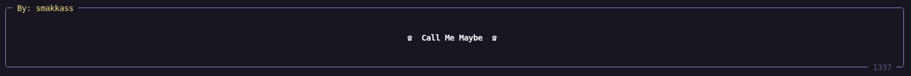
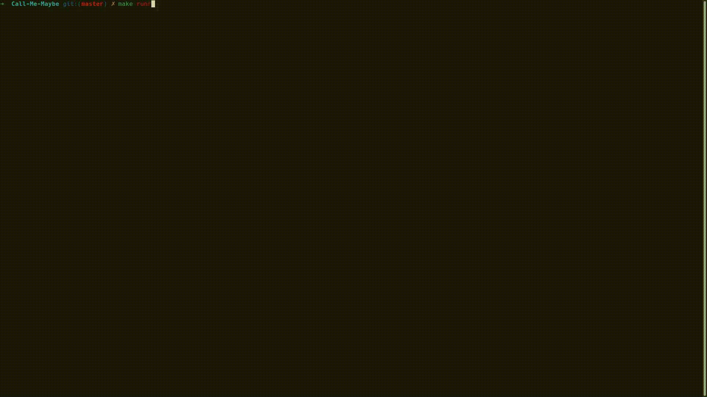

*This project has been created as part of the 42 curriculum by smakkass.*

---

# Call-Me-Maybe

Natural Language to Function Call System.


---

## Table of Contents

- [Description](#description)
- [Features](#features)
- [Instructions](#instructions)
  - [Requirements](#requirements)
  - [Installation](#installation)
  - [Usage](#usage)
- [Usage Demo](#usage-demo)
- [Algorithm Explanation](#algorithm-explanation)
- [Design Decisions](#design-decisions)
- [Performance Analysis](#performance-analysis)
- [Challenges Faced](#challenges-faced)
- [Testing Strategy](#testing-strategy)
- [Resources](#resources)

---

## Description

Call-Me-Maybe is a natural language to function call generator system using the power of AI, developed in Python. Demonstrating the technique known as Constrained Decoding where and LLM's output is forced to adhere to predefined set of rules.

- The program takes as input a list of function defenitions and a list of promts to later turn into valid function calls through the power of AI.
- After proccessing each promt, the program produces a 100% valid predefined JSON function call with the chosen function relating to the prompt and its associated functions filled out with appropriate values adhering to each functions data type.

---

## Features

- Support for multiple data types (integer, float, string, boolean).
- guaranteed valid JSON output.
- Visualization of the generation proccess token by token.
- Support for multiple LLM models.
- Comprehensive error detection and clear error messages.

---

## Instructions

### Requirements

- Python 3.10 or higher
- UV Package manager

### Installation

1. Clone the repository:
```bash
git clone https://github.com/saidmakkass/Call-Me-Maybe.git
cd Call-Me-Maybe
```

2. Install dependencies:
```bash
make install
```

### Usage

Run with the default configuration:
```bash
make run
```

Or specify custom arguments:
```bash
uv run python -m src <args>
```
Args:
| Argument | Description |
| :--- | :--- |
| -h, --help | Show this help message and exit. |
| --functions_definition <file_path> | Path to the function definitions JSON file. |
| --input <file_path> | Path to the input file. |
| --output <file_path> | Path to the output file. |
| --model <model_identifier> | Identifier of the model on the Hugging Face Hub. |
| --debug | Enable debug mode for verbose logging. |

---

## Usage Demo

<div align="center">

| **Demo 1 — Basic** | **Demo 2 — Default data** |
|:------------------:|:-------------------------:|
|  |  |

</div>

---

## Algorithm Explanation

### Overview

Call-Me-Maybe uses constrained decoding to guide an LLM toward a syntactically valid JSON function call instead of letting it generate free-form text. After each step, the system inspects the model’s next-token logits and removes any token that would make the partial output impossible to finish into a valid call for the current function schema.

### Step-by-Step Process

1. Parse the function definitions and prompts from JSON, then build a prompt that tells the model to produce a function call.
2. Maintain the current partial output along with the expected field type for the next piece of content, such as a function name, string value, integer, float, or boolean.
3. Query the model for the next-token logits and decode each candidate token. Mask any token that would violate the rules for the current field.
4. Select the highest-scoring remaining token, append it to the partial output, and update the live visualization.
5. Repeat until a valid terminal condition is reached, such as a complete function name, a closing quote for strings, a delimiter for numbers, or a full boolean literal.

### Constraint Representation

The constraint is represented implicitly as a small set of field-specific validators over the partially generated string. Function names are limited to the known names in the registry, string values must stay inside a quoted span, numeric values must remain valid numbers, and booleans are restricted to the prefixes of "true" or "false". This lightweight state machine fits the project well because the task only requires enforcing a few structured JSON patterns rather than a full general-purpose grammar.

### Complexity

Each decoding step examines the vocabulary logits once and performs a small constant amount of validation work for the current field. In practice, the overhead is linear in the size of the vocabulary per token, and the total cost grows roughly with the number of generated tokens. Because the constraints are simple and local, the extra cost is small compared with the cost of model inference itself.

---

## Design Decisions

- **Token-level masking over post-processing**: The project applies constraints during generation by masking invalid next-token logits before the model chooses the next token. This keeps the output valid from the start and avoids a later rewrite step.
- **Lightweight validator-based state**: Instead of building a full grammar engine, the implementation uses small field-specific checks for function names, strings, integers, floats, and booleans. This keeps the design simple and easy to extend for the limited schema used in this project.
- **Structured, schema-driven generation**: The generator follows the function definitions provided in the input JSON, so each function call is produced according to the declared parameter types rather than relying on a generic free-form decoder.
- **Interactive terminal UI**: The live rendering layer was added to show the evolving function call token by token, which improves transparency and debugging even though it is not essential to correctness.

### Alternatives Considered

- A fully general grammar or parser-based decoder could have enforced stricter syntax, but it would have added much more complexity than this project needs.
- Re-ranking or retrying invalid completions after generation was also possible, but it would have been less efficient and would have made the interface less responsive.
- A completely manual rule-based generator could have produced guaranteed-valid output, but it would have sacrificed flexibility and made the system less aligned with the LLM-based approach.

---

## Performance Analysis

Performance was evaluated by checking the elapsed time to generate valid unction calls with the default inputs.

| Metric | Result |
|--------|--------|
| Elapsed time| 2m 20s |
| Number of functions registered | 5 |
| Number of prompts ran | 11 |
| JSON validity | 100% |
| Correct output | >90% |

---

## Challenges Faced

The main difficulties during development came from making the language model follow a strict output format while still remaining responsive and understandable to the user.

- **Constraining generation without breaking the model flow**: The model often tried to produce invalid tokens or drift away from the target schema. This was solved by masking invalid next-token logits at each step so the model could only continue along valid prefixes.
- **Handling different parameter types reliably**: Strings, integers, floats, and booleans each needed their own decoding rules. The implementation addressed this by introducing dedicated generation logic for each type rather than forcing everything through a single generic path.
- **Balancing correctness with usability**: A fully strict decoder can be correct but hard to observe. The project added a live terminal UI so the evolving JSON structure could be inspected in real time while still preserving deterministic validity.

---

## Testing Strategy

The implementation was validated both at the unit level and through end-to-end generation runs against realistic prompts.

- **Unit tests**: Covered the parsing and validation of function definitions, prompt loading, and the core generation helpers for each supported parameter type.
- **Integration tests**: Verified that the full pipeline could transform natural-language prompts into valid function-call JSON objects with the expected structure.
- **Manual/exploratory testing**: Checked the live UI, error handling, and the behavior of edge cases such as empty strings, invalid numeric forms, and unsupported function names.
- **Test data**: The main inputs came from the JSON files in the data folder, including the function registry and prompt examples used for demonstration and evaluation.

---

## Resources

### References

- [Deep Dive into LLMs like ChatGPT](https://www.youtube.com/watch?v=7xTGNNLPyMI)
- [Structured Output from LLMs: Grammars, Regex, and State Machines](https://www.youtube.com/watch?v=xpvFinvqRCA)
- [A Guide to Structured Generation Using Constrained Decoding](https://www.aidancooper.co.uk/constrained-decoding/)
- [Fast-forward (jump-forward, accelerated) tokens](https://github.com/guidance-ai/llguidance/blob/main/docs/fast_forward.md)
- [Rich library documentation](https://rich.readthedocs.io/en/latest/introduction.html)
- [The JSON Format Standard](https://www.json.org/json-en.html)

### AI Usage

AI tools were used in this project for:
- **Debugging**: Helping diagnose issues in generation logic, prompt formatting, and type-handling edge cases.
- **Learning**: Explaining constrained decoding concepts and reviewing approaches for structured generation.
- **Documentation support**: README drafting, and docstrings.

---
